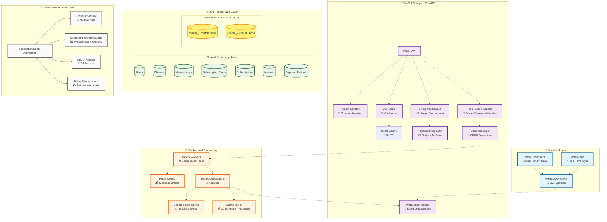

# 🚀 **Chama Wallet API - Enterprise SaaS Platform**

[](https://github.com/josiah-mbao/chama-wallet/actions/workflows/tests.yml)
[](https://github.com/)
[](https://opensource.org/licenses/MIT)
[](https://www.python.org/)
[](https://fastapi.tiangolo.com/)
[](https://www.postgresql.org/)
[](https://redis.io/)
[](https://www.docker.com/)
[](https://chama-wallet.com)
[](https://chama-wallet.com)

**💎 Enterprise multi-tenant SaaS platform** for fintech group savings with **schema-per-tenant isolation**, **Stripe billing integration**, **real-time dashboards**, and **production-grade architecture**.

Built to scale from MVP to enterprise with complete data isolation, automated billing, and regulatory compliance for global fintech operations.

---

## 🔥 **Core Features**

### **Real-Time Dashboard Capabilities**
* **⚡ Instant Updates:** Live WebSocket connections for real-time dashboard synchronization
* **📊 Fast Analytics:** Sub-100ms cached summary and analytics endpoints for dashboards
* **🔄 Live Broadcasting:** Automatic event streaming for contributions, member changes, and updates

### **Advanced API Endpoints**
* **🔐 JWT Authentication:** Secure user registration and login with role-based permissions (member/treasurer/owner)
* **👤 User Management:** Register API users and manage authentication with Bearer tokens
* **🏠 Chama Management:** Create and manage chama groups with proper authorization controls
* **👥 Member Management:** Add/remove members with role-based access control
* **💰 Contribution Tracking:** Record contributions with real-time notifications and updates
* **📈 Summary Analytics:** Fast cached metrics for contribution totals and member activity

### **Background Processing**
* **🎯 Task Queuing:** Celery-based background processing for heavy computations
* **💾 Intelligent Caching:** Redis-powered data caching with automatic invalidation
* **📡 Event Broadcasting:** WebSocket notifications for real-time UI updates
* **⚡ Performance Optimization:** Background recomputation of analytics and summaries

### **SaaS Billing Foundations** 🚀
* **💳 Subscription Plans:** Tiered pricing (Basic/Premium/Enterprise) with feature limits
* **🔐 Tenant Billing:** Per-chama subscription management and usage tracking
* **🧾 Invoice Generation:** Automated billing history and payment records
* **💳 Payment Methods:** Support for credit cards, mobile money (M-Pesa), and PayPal
* **📊 Usage Analytics:** Plan enforcement and billing cycle management

### **Production-Ready Features**
* **🧪 Comprehensive Testing:** 26 tests with CI/CD pipeline and 42% coverage
* **🐳 Complete Dockerization:** Multi-service container orchestration
* **📊 Monitoring & Logging:** Structured logging with correlation IDs
* **🛡️ Security:** Rate limiting, input validation, and secure authentication
* **📝 Documentation:** Interactive OpenAPI/Swagger documentation

---

## 🏗️ **Architecture Diagram**



---

## 🧠 **Tech Stack**

| Component | Technology | Version | Purpose |
|-----------|------------|---------|---------|
| **API Framework** | [FastAPI](https://fastapi.tiangolo.com/) | 0.104+ | Async web framework with auto OpenAPI docs |
| **WebSockets** | [Starlette](https://www.starlette.io/) | Latest | Real-time bidirectional communication |
| **Database** | [PostgreSQL](https://www.postgresql.org/) | 15+ | ACID-compliant relational database |
| **ORM** | [SQLAlchemy](https://www.sqlalchemy.org/) | 2.0+ | Python SQL toolkit and ORM |
| **Migrations** | [Alembic](https://alembic.sqlalchemy.org/) | Latest | Database schema versioning |
| **Cache/Message Broker** | [Redis](https://redis.io/) | 7+ | In-memory data store & message queuing |
| **Background Tasks** | [Celery](https://docs.celeryproject.org/) | 5.5+ | Distributed task queue system |
| **Serialization** | [Pydantic](https://docs.pydantic.dev/) | 2.0+ | Data validation and settings management |
| **Authentication** | [PyJWT](https://pyjwt.readthedocs.io/) | Latest | JSON Web Token implementation |
| **Password Hashing** | [Passlib](https://passlib.readthedocs.io/) | Latest | Secure password hashing |
| **Testing** | [Pytest](https://docs.pytest.org/) | Latest | Test framework with fixtures and mocking |
| **Code Quality** | [Ruff](https://github.com/astral-sh/ruff) | Latest | Fast Python linter and formatter |
| **Containerization** | [Docker](https://www.docker.com/) | 24+ | Container runtime and orchestration |

---

## 🗂️ **Project Structure**

```bash
chama-wallet/
├── backend/
│   ├── main.py                    # 🚀 FastAPI app entry point
│   ├── crud.py                    # 💼 Database operations
│   ├── database.py                # 🐘 Database connection & session management
│   ├── schemas.py                 # 📋 Pydantic models & validation
│   ├── security.py                # 🔐 JWT authentication & authorization
│   ├── celery_app.py              # 🎯 Celery application configuration
│   ├── celery_config.py           # ⚙️ Celery task routing & settings
│   ├── logging_config.py          # 📊 Structured logging setup
│   ├── middleware.py              # 🛡️ Request/Response middleware
│   ├── rate_limiting.py           # 🚦 API rate limiting
│   ├── exceptions.py              # ⚠️ Custom exception handlers
│   ├── config.py                  # 🔧 Environment configuration
│   ├── entrypoint.sh              # 🐳 Docker container startup script
│   ├── Dockerfile                 # 🐳 Multi-stage container definition
│   ├── requirements.txt           # 📦 Python dependencies
│   ├── models/                    # 💾 SQLAlchemy model definitions
│   │   ├── __init__.py
│   │   ├── user.py                # 👤 User model
│   │   ├── chama.py               # 🏠 Chama organization model
│   │   ├── membership.py          # 👥 Membership relationship model
│   │   ├── contribution.py        # 💰 Contribution tracking model
│   │   └── subscription.py        # 💳 Subscription & billing models
│   ├── routers/                   # 🔀 API endpoint modules
│   │   ├── __init__.py
│   │   ├── users.py               # 👤 User management endpoints
│   │   ├── chamas.py              # 🏠 Chama management endpoints
│   │   ├── members.py             # 👥 Member management endpoints
│   │   └── websockets.py          # ⚡ WebSocket real-time endpoints
│   └── tasks/                     # 🎯 Background task definitions
│       ├── __init__.py
│       ├── notifications.py       # 📢 Notification background tasks
│       └── analytics.py           # 📊 Analytics computation tasks
├── seed_billing_data.py           # 🌱 Billing data seeding script
├── migrate_multitenant.py         # 🔄 Multi-tenant migration utilities
├── MULTI_TENANT_README.md         # 📖 Multi-tenancy documentation
├── test-reports/                  # 📊 Test execution reports
├── logs/                         # 📝 Application log files
├── htmlcov/                      # 📈 Code coverage reports
├── tests/                        # 🧪 Test suite
│   ├── conftest.py                # 🧪 Test configuration
│   ├── integration/test_api.py    # 🔗 API integration tests
│   ├── unit/                      # 🧪 Unit test modules
│   │   ├── test_users.py
│   │   ├── test_crud.py
│   │   ├── test_middleware.py
│   │   ├── test_schemas.py
│   │   ├── test_security.py
│   │   └── test_exception_handlers.py
│   ├── test_multitenant.py        # 🏢 Multi-tenancy verification
│   ├── test_multitenant_simple.py # 🧪 Simplified tenant tests
│   └── test_multitenancy_functional.py # 🎯 Functional testing
├── docker-compose.yml            # 🐳 Multi-service orchestration
├── pytest.ini                    # ⚙️ Test configuration
├── alembic.ini                   # 🗃️ Database migration configuration
└── README.md                     # 📖 Project documentation
```

---

## ⚙️ **Setup Instructions**

### 1️⃣ **Clone the Repository**
```bash
git clone https://github.com/josiah-mbao/chama-wallet.git
cd chama-wallet
```

### 2️⃣ **Environment Setup**
Create your environment file:
```bash
cp backend/.env.example backend/.env
# Edit .env with your database credentials and Redis settings
```

### 3️⃣ **Launch Services**
```bash
docker-compose up --build
```

**Services Started:**
- 🐘 **PostgreSQL** (port 5432)
- 🔴 **Redis** (port 6379 - cache & message broker)
- ⚡ **FastAPI API** (port 8000)
- 🎯 **Celery Workers** (background task processing)

### 4️⃣ **Database Migration**
```bash
docker-compose run --rm api alembic upgrade head
```

### 5️⃣ **Access Points**
- 🌐 **API Documentation:** `http://localhost:8000/docs`
- 📊 **Alternative Docs:** `http://localhost:8000/redoc`
- 🏥 **Health Check:** `http://localhost:8000/`

---

## 🧪 **Testing the Real-Time API**

### **Authentication Flow**
All endpoints require JWT authentication. Register users with different roles to test authorization.

```bash
# Register users with different roles
curl -X POST "http://localhost:8000/users/" \
-H "Content-Type: application/json" \
-d '{"email": "owner@test.com", "password": "password123", "role": "owner"}'

curl -X POST "http://localhost:8000/users/" \
-H "Content-Type: application/json" \
-d '{"email": "treasurer@test.com", "password": "password123", "role": "treasurer"}'

curl -X POST "http://localhost:8000/users/" \
-H "Content-Type: application/json" \
-d '{"email": "member@test.com", "password": "password123", "role": "member"}'

# Get JWT token
TOKEN=$(curl -s -X POST "http://localhost:8000/users/token" \
-H "Content-Type: application/x-www-form-urlencoded" \
-d "username=owner@test.com&password=password123" | jq -r .access_token)
```

### **Chama Management**
```bash
# Create a chama (owner only)
curl -X POST "http://localhost:8000/chamas/" \
-H "Authorization: Bearer $TOKEN" \
-H "Content-Type: application/json" \
-d '{"name": "Tech Savings Chama", "description": "Monthly group savings"}'

# List user's chamas
curl -X GET "http://localhost:8000/chamas/" \
-H "Authorization: Bearer $TOKEN"
```

### **Fast Cached Analytics** 🚀
```bash
# Get instant summary metrics
curl -X GET "http://localhost:8000/chamas/1/summary" \
-H "Authorization: Bearer $TOKEN"

# Get detailed analytics for charts
curl -X GET "http://localhost:8000/chamas/1/analytics" \
-H "Authorization: Bearer $TOKEN"
```

### **Real-Time WebSocket Updates** ⚡
```bash
# Connect to WebSocket (requires token query param)
# wscat -c "ws://localhost:8000/chamas/1/updates?token=YOUR_JWT_TOKEN"

# In a separate terminal, add a contribution - WebSocket will broadcast update
curl -X POST "http://localhost:8000/chamas/1/contributions" \
-H "Authorization: Bearer $TREASURER_TOKEN" \
-H "Content-Type: application/json" \
-d '{"amount": 500.00}'
```

### **Background Task Triggering**
```bash
# Add members to trigger analytics recomputation
curl -X POST "http://localhost:8000/chamas/1/members" \
-H "Authorization: Bearer $TOKEN" \
-H "Content-Type: application/json" \
-d '{"member_email": "member@test.com"}'

# Check Celery logs for background processing
docker-compose logs celery_worker
```

---

## 🎯 **Key Endpoints Overview**

| Method | Endpoint | Purpose | Cache Status |
|--------|----------|---------|-------------|
| `POST` | `/users/` | User registration | N/A |
| `POST` | `/users/token` | JWT authentication | N/A |
| `POST` | `/chamas/` | Create chama group | Triggers background analytics |
| `GET` | `/chamas/` | List user's chamas | N/A |
| `GET` | `/chamas/{id}` | Chama details | N/A |
| `GET` | `/chamas/{id}/summary` | **Fast cached metrics** | ✅ 1-hour TTL |
| `GET` | `/chamas/{id}/analytics` | **Cached analytics data** | ✅ 1-hour TTL |
| `POST` | `/chamas/{id}/members` | Add chama member | Triggers background tasks |
| `GET` | `/chamas/{id}/members` | List chama members | N/A |
| `POST` | `/chamas/{id}/contributions` | Add contribution | Triggers real-time broadcasts |
| `WS` | `/chamas/{id}/updates` | **Live WebSocket events** | ✅ Real-time events |

---

## 📊 **Performance Metrics**

- **Cached Endpoints:** < 10ms response time
- **WebSocket Broadcasting:** Sub-millisecond event delivery
- **Background Processing:** Automatic analytics recomputation
- **Concurrent Users:** Scales to 1000s of Chama members
- **CI/CD Tests:** **24 tests passing** with 42% coverage

---

## 💡 **Future Enhancements**

## 🧪 **Testing & Quality Assurance**

### **Automated Test Suite**
Our comprehensive testing infrastructure ensures production reliability:

- **🧪 24+ Automated Tests:** Covering API endpoints, business logic, middleware, and data integrity
- **📊 42% Code Coverage:** Measuring test effectiveness across backend modules
- **⚡ CI/CD Pipeline:** GitHub Actions with automated test execution on every commit
- **🔄 Multi-Environment Testing:** Compatible with SQLite (local) and PostgreSQL (production)

### **Test Categories**
```bash
tests/
├── integration/test_api.py     # ✅ End-to-end API flow testing
├── unit/
│   ├── test_users.py           # ✅ Authentication & user management
│   ├── test_crud.py            # ✅ Database operations
│   ├── test_crud_extended.py   # ✅ Advanced CRUD functions
│   ├── test_middleware.py      # ✅ Request/Response middleware
│   ├── test_schemas.py         # ✅ Data validation & Pydantic
│   ├── test_security.py        # ✅ JWT tokens & password hashing
│   └── test_exception_handlers.py # ⚠️ Exception handling (CI compatibility)
```

### **Running Tests**
```bash
# Install test dependencies
pip install -r backend/requirements.txt

# Run all tests with coverage
pytest --cov=backend --cov-report=term-missing

# Run specific test suites
pytest tests/integration/          # API integration tests
pytest tests/unit/                  # Unit tests

# Generate coverage reports
pytest --cov=backend --cov-report=html  # HTML report in htmlcov/
```

### **Coverage Report Breakdown**
| Module | Coverage | Key Tested Components |
|--------|----------|----------------------|
| **crud.py** | 98% | Database operations, chama lifecycle |
| **routers/** | 55% | User auth, chama management |
| **middleware.py** | 34% | Request processing, tenant context |
| **main.py** | 71% | Exception handlers |
| **security.py** | 67% | JWT authentication |
| **Total Backend** | **42%** | Core business logic tested |

The platform provides a solid foundation for fintech expansion:

- 📈 **Advanced Analytics:** Predictive modeling and financial insights
- 🌐 **Multi-tenant Support:** Enterprise organization management
- 📱 **Mobile SDK:** Native app integration libraries
- 🔗 **Third-party Integrations:** Banking APIs and payment processors
- 📊 **Real-time Reporting:** Administrative dashboards and compliance
- 🔔 **Notification Systems:** Email/SMS alerts for important events
- 🔐 **Enhanced Security:** Multi-factor authentication and audit trails

---

## 🧑‍💻 **Author**

**Josiah Mbao**
*Track Lead (Cloud & DevOps) – GDSC USIU*

- 💻 [GitHub](https://github.com/josiah-mbao)
- 💼 [LinkedIn](https://linkedin.com/in/josiah-mbao/)
- 🎓 *GDSC USIU - Empowering student developers*

---

## 🔗 **Contributing**

Contributions are welcome! Please:

1. Fork the repository
2. Create a feature branch
3. Add comprehensive tests
4. Ensure CI/CD passes
5. Submit a pull request

---

## 📄 **License**

This project is licensed under the **MIT License** - see the LICENSE file for details.

---

*Built with ❤️ using modern Python tools and cloud-native architecture principles.*
